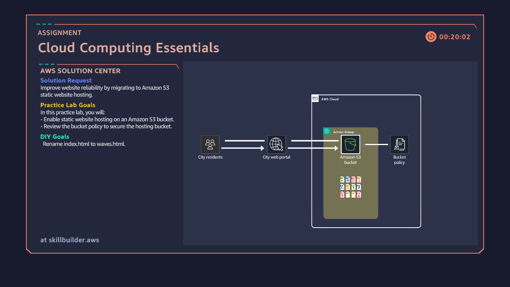

#  Task 1: Static Website Hosting with Amazon S3

##  Assignment
**Solution Request:** Improve website reliability by migrating to Amazon S3 static website hosting.

**Practice Lab Goals:**
- Enable static website hosting on an Amazon S3 bucket.
- Review the bucket policy to secure the hosting bucket.

**DIY Goal:**
- Rename `index.html` to `waves.html`.

---

##  Steps I Completed
1. Used the pre-created S3 bucket.
2. Enabled **S3 Static Website Hosting**.
3. Verified the site was running at the given S3 endpoint URL.
4. Renamed the default page `index.html` → `waves.html`.

---

##  Task Completion Snapshot

---

##  Skills Learned
- Hosting static websites on **Amazon S3**.
- Configuring and validating **bucket policies**.
- Understanding how to set default documents for static hosting.
