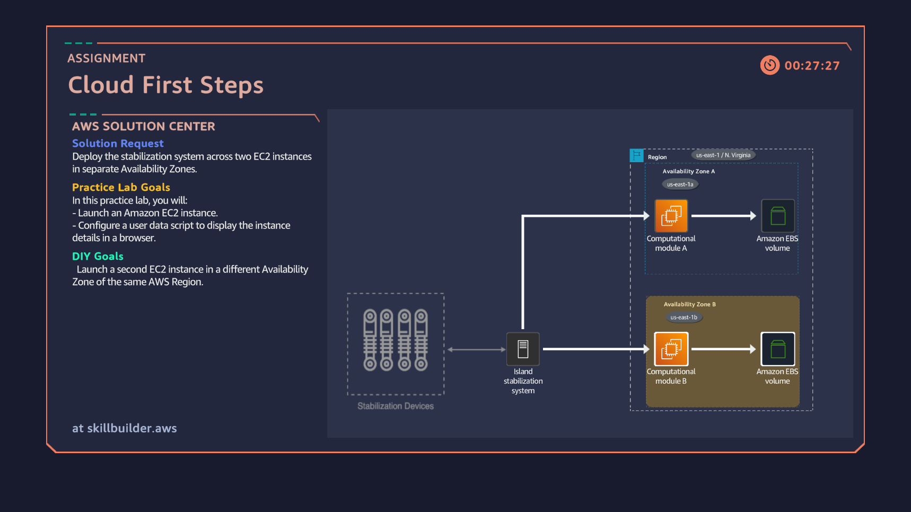

# Task 2: Launching EC2 Instances in Multiple Availability Zones

## Assignment
**Solution Request:** Deploy the stabilization system across two EC2 instances in separate Availability Zones.  

**Practice Lab Goals:**
- Launch an Amazon EC2 instance.
- Configure a user data script to display the instance details in a browser.

**DIY Goal:**
- Launch a **second EC2 instance** in a **different Availability Zone** of the same AWS Region (N. Virginia).

---

## Steps I Completed
1. Launched the first EC2 instance in **us-east-1a**.
2. Configured the instance with a user data script.
3. Launched a second EC2 instance in **us-east-1b** (different AZ).
4. Verified both instances were running in separate Availability Zones.
5. Submitted the instance IDs for validation in Cloud Quest.

---

## Task Completion Snapshot

---

## Skills Learned
- Launching and managing **Amazon EC2 instances**.
- Understanding **Availability Zones** within the same region.
- Deploying resources for **high availability**.
- Validating deployments using AWS Skill Builder labs.

---

## Rewards in Cloud Quest
-  **Unlocked Bungalow**
-  **Adopted a Pet**
