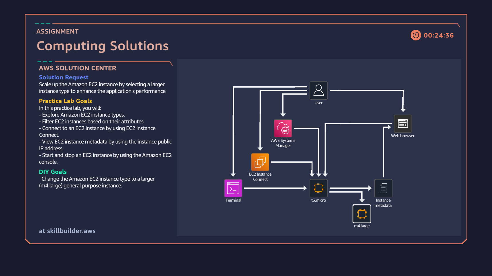

# Task 3: Computing Solutions (EC2 Scaling)

## Assignment
**Solution Request:** Scale up the Amazon EC2 instance by selecting a larger instance type to enhance application performance.  

**Practice Lab Goals:**
- Explore Amazon EC2 instance types.
- Filter EC2 instances based on their attributes.
- Connect to an EC2 instance using EC2 Instance Connect.
- View EC2 instance metadata by using the instance public IP.
- Start and stop an EC2 instance from the AWS Console.

**DIY Goal:**
- Change the Amazon EC2 instance type to a larger **m4.large** general purpose instance.

---

## Steps I Completed
1. Connected to the EC2 instance using **EC2 Instance Connect**.
2. Stopped the running instance from the AWS Console.
3. Changed the instance type from **t3.micro → m4.large**.
4. Restarted the instance and verified the new instance type.
5. Checked instance metadata and confirmed performance scaling.

---

## Task Completion Snapshot

---

## Skills Learned
- Stopping, starting, and modifying EC2 instances.
- Changing instance types for **scalability**.
- Viewing EC2 metadata for validation.
- Understanding **general purpose vs. compute scaling**.

---

## Rewards in Cloud Quest
- **Unlocked Park**
- **Improved City Infrastructure**

