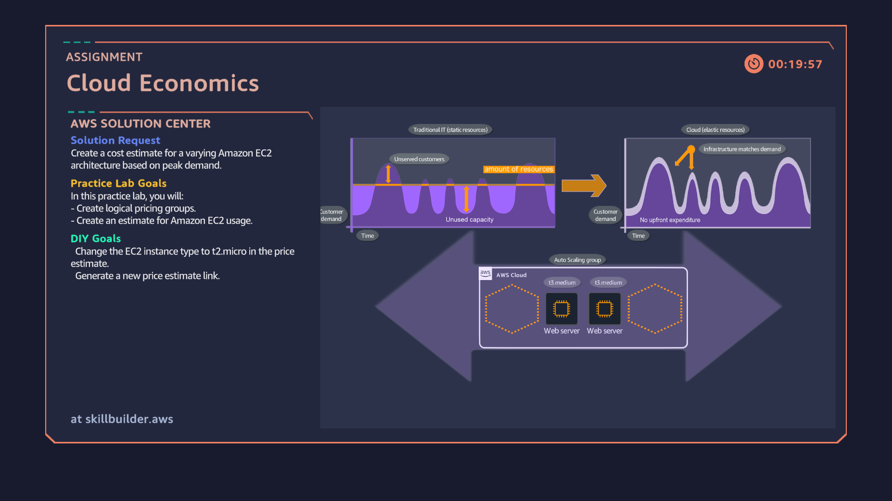

# Task 4: Cloud Economics (Pricing Estimates)

## Assignment
**Solution Request:** Create a cost estimate for Amazon EC2 instances based on peak demand.  

**Practice Lab Goals:**
- Create logical pricing groups in AWS Pricing Calculator.
- Estimate Amazon EC2 usage costs.

**DIY Goal:**
- Change the EC2 instance type to **t2.micro** in the price estimate.  
- Generate a new **AWS Pricing Calculator link**.

---

## Steps I Completed
1. Opened the **AWS Pricing Calculator**.
2. Created a pricing group for EC2 instances.
3. Added an EC2 instance with default configuration.
4. Changed the instance type to **t2.micro** for cost estimation.
5. Generated a new **pricing estimate link** for submission.

---

## Task Completion Snapshot

---

## Skills Learned
- Using the **AWS Pricing Calculator**.
- Estimating costs for different EC2 instance types.
- Comparing pricing across instance families.
- Understanding **cloud economics** and cost optimization.

---

## Rewards in Cloud Quest
- **Unlocked Marketplace**
- **Unlocked Vehicle: Scooter**
- **Earned Extra Coins**
